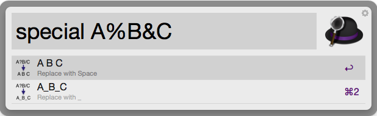

# Special Char — Workflow for Alfred

Replaces special characters with space or underscore and copies result to clipboard

[Download the workflow](https://github.com/gillibrand/alfred-change-case/raw/master/Change%20Case.alfredworkflow).

## Usage

Remove special characters from Cliboard with the keyword `case`. Two results are previewed as Alfred results, one with SPACE and one with _. Select one to copy it to the clipboard and paste into in the current application.

Optionally, any text typed after `special` will be changed instead of the clipboard. 

## Version History

### 9/03/2014

- First version

## Credits

- Based on Workflow by Jay Gillibrand, https://github.com/gillibrand/alfred-change-case/raw/master/Change%20Case.alfredworkflow
